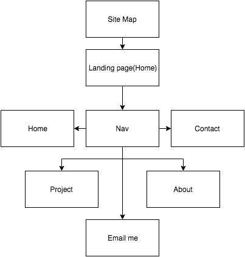
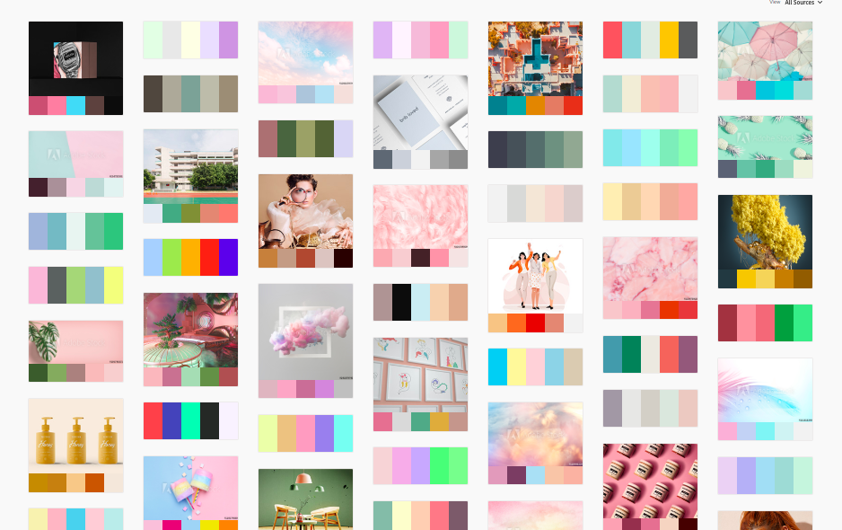
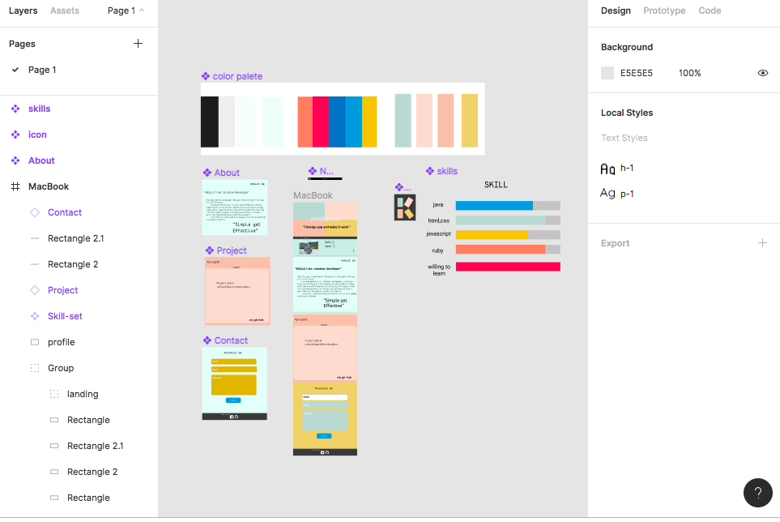
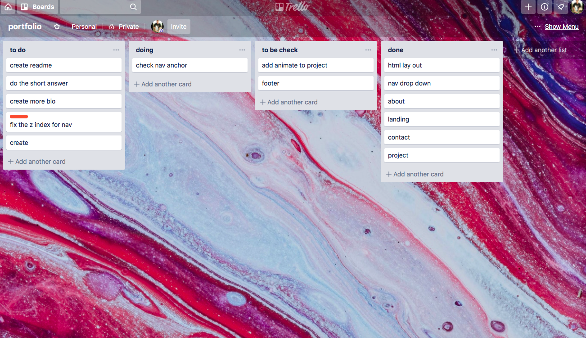
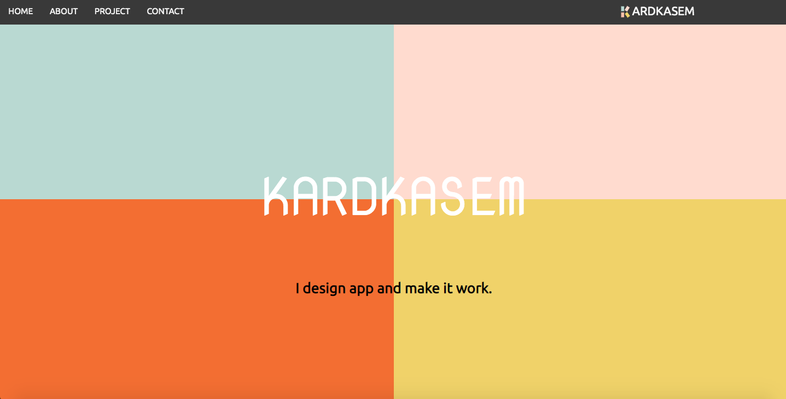
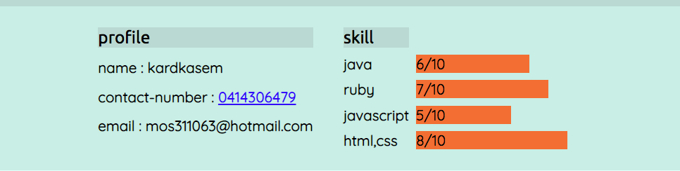
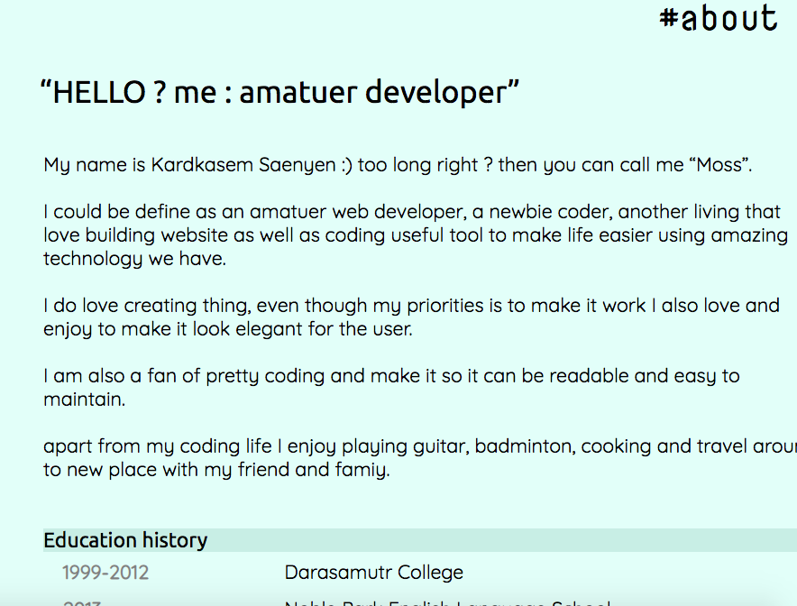
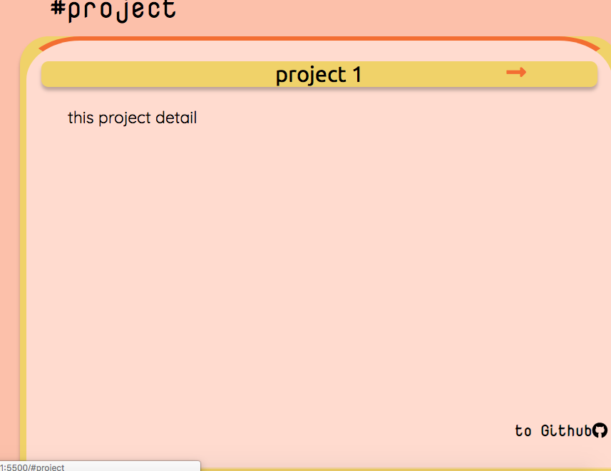
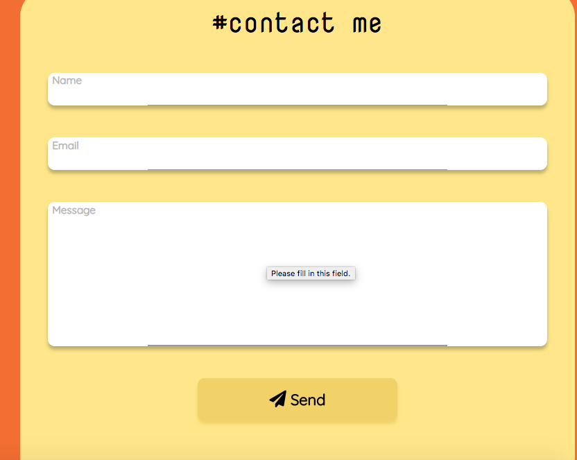

# Portfolio | Kardkasem

"welcome to my first portfolio showcase. siteis using pure html and css. this portfolio is done as part of assignment at coder academy(Melbourne)."

- deploy-site : https://kardkasem.netlify.com
- github : https://github.com/mos311063

---

## Description && Purpose

this portfolio is done as part of assignment at coder academy(Melbourne). it purpose is to give information about me and also serve as show case for my project and my ability.

## Target Audience

I hope my portfolio is able to deliver information about me and deliver some sort of design and coding skill to impress employer.
I also hope it inspire any developer out there or could be use as an example for designing responsive website to anyone.

## Functionality

- it code using only html and css therefore it is the fast on load.
- it design is fully responsive (all as much as I could make it possible).
- it can view in both major web browser and mobile.

## Tech Stack

  this project was coded using pure HTML5 and CSS3 
  - design : pastel design
  - responsive : yes thank to flex and grid display, calc() , @media ;
  - it deployed : the site is store in github and deploy via netlify.
  - contact form : via Formspree API site.

## Sitemap

my website is divine it to 4 main section and 1 sub section include

- Home : it is also my landing page.
- about me : detail about me.
  - contact : a contact detail about me as well as my skill list
- project : all my work and link to my github.
- email me : a contact form.

all the section is accessible via nav bar at the top.

 

 

---

 

## Design inspire
the design was inspire by when my educator was introduce previos portfolio for past students and most of them are in dark or plain color which inspire me to do something diffrent and since then I decide that I want my portfolio to me consist of colorful component. 

 

## Design

when I first design this portfolio. I really have no idea what to do, but thank to Figma. this is my first time using Figma and I was blown away by its features and how well it works. I help me so much on design process which i consider myself really bad.

### Color Selection
I want my site to be colorful but also reable and not too much bright and hurt user eye and from that I decide to  made it look pastel, giving a user a soft, neutral, soothing feeling.

my site consist of 4 main color which is
 -  #bfd8d2
 -  #fedcd2
 -  #e57549
 -  #edcf79

 ### Logo

 

 logo is made using figma, it made base on my first name (obviosly) and the 4 main color scheme I use 

 ### Usability Considerations
 - readable
 - easy to navigated
 - colorful
 - soft look
 - single page website

---

### Planning Process
Project plan & timeline

- design : figma
    - the design process is what I found most difficult. it sometime hard to come up with good and creative idea especially the project is to be submit in just over a week.

- coding : vscode
    - once the design is done the process I start code my site start by doing it lay out and style each section one by one then putting it together, adding animation and testing it.

### Trello

I use trello to note what I need to do orderly and what aspect is require by educator and also trello help me a lot to remember when I come up with an idea that I want it to be on my site.

 

### Future Enhancements
- adding javascript to the page.
- I would like nav to be from bottom of page.
- custom domain

## Screenshot

---

### Short Answer 

<strong>Describe key events in the development of the internet from the 1980s to today (max. 150 words)</strong>
back in late

- Early Internet history was dominated by government institutions and the academic world. In 1994, the Internet went public.the early website is just a plain and static site and then it process it evolve from static to be animate, to be dynamic and when mobile device is more popular to use to access internet than desktop reponsive design come in to popular and up until now the internet for still evove a lot has change. the thing that was hard or couldnt do in the past become more efficient and easier for developper.

<strong>Define and describes the relationship between fundamental aspects of the internet such as: domains, web servers, DNS, and web browsers (max. 150 words)</strong>
 - Internet domain is part of a system in which Internet addresses are linked to. when
domain name is label that identifile it,a web server includes several parts that control how web users access hosted files while DNS is it act like it name of that server. web browser is a software application for accessing information on world wide web via HTTP protocal.

<strong>Reflect on one aspect of the development of internet technologies and how it has contributed to the world today (max. 150 words)</strong>

- there is huge impact of the internet technologies to the world in the past 40 year. The main purpose of the Internet is offering effective information sharing and communication globally using computers. but the most aspect I think is change a lot in today world is how people advertising their product. In 2019 world we will see an ad all around website from the serch engine to video. it not just on the tv as it used to be and people start to watch every thing online over paper or tv now. I still remember when I was young as always see that every house must have a television but that doesnt seem to be the case in the present.